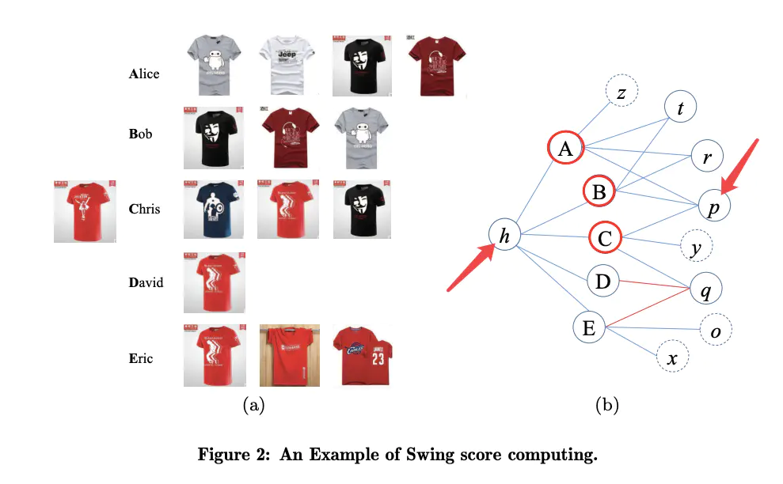

# Swing
## Swing算法定义
Swing算法是阿里提出的一种召回算法，Swing算法认为`user - item - user`结构比itemCF单边`item - item`的结构更稳定，形成`user - item - user`的局部图结构关系（秋千）；**对于共同点击商品i，j的用户，如果用户之间共同点击的商品越少则商品i，j就越相似**。商品i，j的Swing得分计算如下：

上式中，Ui表示点击商品i的所有用户；Iu表示用户u点击的所有商品；α是一个平滑因子。
## Swing实例
下图中，A、B、C表示用户；h、t、r、p表示商品；如果用户和商品之间存在交互关系则连接一条边。假设需要计算h、p商品的相似度，共同点击商品h、p的用户集合为：{A,B,C}；

## Swing权重
在上述Swing计算公式中，没有考虑用户权重信息；可以考虑加入用户权重信息，比如可以对较活跃的用户做一定的惩罚；下面公式中，wu表示用户u的权重，其跟用户点击的商品数量成反比；还可以考虑加入商品权重信息；

